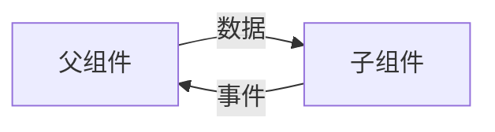

> http://ts.xcatliu.com/ ： typescript入门
>
> https://jkchao.github.io/typescript-book-chinese/ ： 深入typescriot
>
> http://angular.cn/guide/setup-local ： angular官方教程
>
> https://docs.microsoft.com/zh-cn/ ： 微软官方文档

[TOC]


## Sotre实战上手

- 查看`npm`全局安装的包`npm list -g --depth 0`

### Angular CLI 

- 安装`npm install -g @angular/cli`
- 创建项目 `ng new <project-name>`
- 创建一个组件`ng generator component <component-name>` 
- 创建一个服务`ng generator service <component-name>` 
- 版本降级
  - 全局卸载`npm uninstall -g @angular/cli`
  - 清除缓存`npm cache clean --force`，并检验是否卸载完毕`ng v`
  - 安装指定版本`npm install -g @angular/cli@13`


### 组件通信

父组件向子组件传递数据；以及子组件向父组件传递事件

```typescript
// 子组件
import { Component, EventEmitter, Input, OnInit, Output } from '@angular/core';
interface Product {
  id: number;
  name: string;
  price: number;
  description: string;
}
export class ProductAlertsComponent implements OnInit {
  // 父 => 子 子组件需要声明input()属性
  // 子 => 父 output() 定义EventEmitter事件
  @Input() product!: Product
  @Output() notify = new EventEmitter()
  constructor() { }
  ngOnInit(): void { }
}
```
```typescript
import { Component, OnInit } from '@angular/core';

@Component({
  selector: 'app-product-lists',
  templateUrl: './product-lists.component.html',
  styleUrls: ['./product-lists.component.css'],
  template: ` 
  <app-product-alerts 
  	[product]="product" (notify)="onNotify()"
  	>
  </app-product-alerts>	
`
})
export class ProductListsComponent implements OnInit { 
  product = {
    id: 1,
    name: 'Phone XL',
    price: 799,
    description: 'A large phone with one of the best screens'
  },
  onNotify() {
    window.alert('You will be notified when the product goes on sale');
  }
  constructor() { }
  ngOnInit(): void { }

}
```

### 管道

管道的优先级要高于其他运算符

| 管道 | 详情DETAILS |
| :--- | :---------- |
| [`DatePipe`](http://angular.cn/api/common/DatePipe)          | 根据区域设置规则格式化日期值。                               |
| [`UpperCasePipe`](http://angular.cn/api/common/UpperCasePipe) | 把文本转换成全大写形式。                                     |
| [`LowerCasePipe`](http://angular.cn/api/common/LowerCasePipe) | 把文本转换成全小写形式。Transforms text to all lower case.   |
| [`CurrencyPipe`](http://angular.cn/api/common/CurrencyPipe)  | 把数字转换成货币字符串，根据语言环境中的规则进行格式化。     |
| [`DecimalPipe`](http://angular.cn/api/common/DecimalPipe)    | 把数字转换成带小数点的字符串，根据语言环境中的规则进行格式化。 |
| [`PercentPipe`](http://angular.cn/api/common/PercentPipe)    | 把数字转换成百分比字符串，根据语言环境中的规则进行格式化。   |

```html
<h3>price: {{129 | currency}}</h3>

// $129
```

### 导航路由

在`app.module.ts`文件中注册路由组件

```typescript
import { AppRoutingModule } from './app-routing.module';
@NgModule({
  /* ... */
  imports: [
    /* ... */
    AppRoutingModule,
    /* ... */
  ],
})
export class AppModule { }
```

抽离出单独的文件`app-routing.module.ts`来管理路由；

```typescript
import { NgModule } from '@angular/core';
import { RouterModule, Routes } from '@angular/router';
import { ProductDetailsComponent } from './product-details/product-details.component';
import { ProductListsComponent } from './product-lists/product-lists.component';


const routes: Routes = [
  { path: '', component: ProductListsComponent },
  { path: 'products/:productId', component: ProductDetailsComponent },
];

@NgModule({
  imports: [RouterModule.forRoot(routes)],
  exports: [RouterModule]
})
export class AppRoutingModule { }
```

通常通过`RouterModule.forRoot()`方法来进行注册，并导出`RouterModule`来提供给其他组件使用。

路由的跳转和使用

> [路由参考手册](http://angular.cn/guide/router-reference)

```html
// 通过a标签的routerlink跳转，传入一个数组，为斜杠拆分后的地址栏后缀
<a [routerLink]="['/products', product.id]"></a>
// 还有很多用法...
```

### 服务

创建一个服务，其他应用可以导入此服务，来使用其中的类型、方法。

导入方式一般实在构造函数中注入。像这样

```typescript
export class CartService { 
    constructor(private http: HttpClient) { }
}
```

### http 请求

通过全局注册Angular自身的包`HttpClientModule`，并在服务中引入`HttpClient`使用

```typescript
import { HttpClient } from '@angular/common/http';
export class CartService { 
    constructor(private http: HttpClient) { }
    getData(){
        this.http.get<number[]>('http:xxx.xxx/api')
    }
}
```

### 表单

1. 全局注册 `ReactiveFormsModule`
2. 局部引入`FormBuilder`
3. 创建group表单对象 `formBuilder.group()`
4. 书写表单

```html
<form [formGroup]="checkoutForm" (ngSubmit)="onSubmit()">
  <label for="name">
    Name:
  </label>
  <input type="text" id="name" formControlName="name">
  <br>
  <label for="address">
    Address:
  </label>
  <input type="text" id="address" formControlName="address">
  <br>
  <button type="submit">Purchase</button>
</form>
```

## Angular 基础知识


### 视图封装-CSS的处理方式

`Component` 的装饰器提供了 [`encapsulation`](https://angular.cn/api/core/Component#encapsulation) 选项，可用来控制如何基于*每个组件*应用视图封装。

| 模式                          | 详情                                                         |
| :---------------------------- | :----------------------------------------------------------- |
| `ViewEncapsulation.Emulated`  | 组件的样式会添加到文档的 `<head>` 中，使它们在整个应用程序中可用，但它们的选择器只会影响它们各自组件模板中的元素。 |
| `ViewEncapsulation.None`      | 组件的样式会添加到文档的 `<head>` 中，使它们在整个应用程序中可用，因此是完全全局的，会影响文档中的任何匹配元素。 |
| `ViewEncapsulation.ShadowDom` | 组件样式仅添加到 shadow DOM 宿主中，确保它们仅影响各自组件视图中的元素。 |

每一个组件都可以设置自己的封装方式，但是不建议混合封装，除非非常了解不同模式的封装行为。

###  组件交互-组件通信 

除了上文提到的父组件绑定输入属性给子组件传数据，和子组件自定义事件传递给父组件传递事件和数据两种方式外。

下文将会详细的说明指令在父子组件通信的使用。

1. ### 还可以通过`setter`和`ngOnChanges()`来拦截输入属性的变化，从而做一些事情，比如打日志，预处理。

```typescript
// setter
export class NameChildComponent { 
  @Input()
  get name(): string { return this._name; }
  set name(name: string) {
    this._name = (name && name.trim()) || '<no name set>';
  }
  private _name = '';
}
// ngOnChanges()
export class NameChildComponent { 
  @Input() name : string
  	ngOnChanges(changes : SimpleChanges){
        for(let propName of changes){
            const changeProp = changes[propName]
            const to = JSON.stringify(changeProp.currentValue)
            if(changeProp.isFirstChanged()){
		     console.log('初始值:' + to)
            } else {
              const from = JSON.stringify(changeProp.previousVlaue)
              console.log(`${propName} 由${from} 更改为${to}`)
            }
        }
    }
}
```

2. ### 或者通过本地变量的方式，使父组件可以访问子组件的属性和方法。

```typescript
@Component({
  selector: 'app-countdown-parent-lv',
  template: `
    <h3>Countdown to Liftoff (via local variable)</h3>
    <button type="button" (click)="timer.start()">Start</button>
    <button type="button" (click)="timer.stop()">Stop</button>
    <div class="seconds">{{timer.seconds}}</div>
    <app-countdown-timer #timer></app-countdown-timer> 
  `,
  styleUrls: ['../assets/demo.css']
})
export class CountdownLocalVarParentComponent {
  // 也就是这里无法访问子组件的属性和方法
}
```

`#timer`就是定义本地变量的方式，模板中可以直接通过`timer.start()`来访问子组件的方法，非常方便。

但是也有弊端，就是父组件类中的代码无法访问子组件，只能在模板中使用。

3. ### 为了解决 2 的问题，`@ViewChild`可以很好的解决。将子组件通过此方式注入到父组件中即可。

```typescript
export class CountdownViewChildParentComponent implements AfterViewInit {

  @ViewChild(CountdownTimerComponent) // 注入子组件
  private timerComponent!: CountdownTimerComponent; // 私有变量保存

  seconds() { return 0; }

  ngAfterViewInit() {
    setTimeout(() => this.seconds = () => this.timerComponent.seconds, 0);
  }

  start() { this.timerComponent.start(); }
  stop() { this.timerComponent.stop(); }
}
```

`ngAfterViewInit()` 生命周期钩子是非常重要的一步。被注入的计时器组件只有在 Angular 显示了父组件视图之后才能访问，所以它先把秒数显示为 0。

然后 Angular 会调用 `ngAfterViewInit` 生命周期钩子，但这时候再更新父组件视图的倒计时就已经太晚了。Angular 的单向数据流规则会阻止在同一个周期内更新父组件视图。应用在显示秒数之前会被迫**再等一轮**。

使用 `setTimeout()` 来等下一轮，然后改写 `seconds()` 方法，这样它接下来就会从注入的这个计时器组件里获取秒数的值。

4. ### 最后的，父子组件通过服务来通信

主要遵循发布-订阅模式，通过服务类的共同实例来进行任务的发布和接收。借用到`rxjs`的一些对象和类

父组件实例化一个服务类，并将此实例通过`providers`共享给子组件，两者就可以使用同一个实例进行通信了。

> 详细的和具体代码[看这里](https://angular.cn/guide/component-interaction#parent-and-children-communicate-using-a-service)

2022-7-4

---

### 指令

- `@Input`
  

`[item]`即为子组件通过`input`定义的输入属性，父组件通过赋值将自己的数据传递给子组件的`item`

- `@Output`

Output所定义的事件必须是`EventEmitter`类型的；传给父组件的数据是通过形参`$event`获取的；父组件必须有相应的函数方法来应对、绑定子组件的自定义事件。

```typescript
// 子组件
import { Output, EventEmitter } from '@angular/core';

export class xxx {
  @Output() newItemEvent = new EventEmitter<string>();
    
  addNewItem(value: string) {
    this.newItemEvent.emit(value);
  }
}
// 父组件
@Component({
  selector: 'parrent-component',
  template: `<app-item-output (newItemEvent)="addItem($event)"></app-item-output>`,
  /* ... */
})
export class xxx{
  items = ['item1', 'item2', 'item3', 'item4'];
  addItem(newItem: string) {
    this.items.push(newItem);
  }
}

```

-  同时使用两者
   
   ​	



### 简单的内容投影

通过`<ng-content>`元素进行投影，大致的使用方法有两种

1. 单插槽

```typescript
// 被投影组件
import { Component } from '@angular/core';

@Component({
  selector: 'app-zippy-basic',
  template: `
    <h2>Single-slot content projection</h2>
    <ng-content></ng-content>
  `
})
export class ZippyBasicComponent {}

// 投影内容
import { Component } from '@angular/core';

@Component({
  selector: 'app-zippy-content',
  template: `
  	<app-zippy-basic>
  		<p>我是投影的内容</p>
  	</app-zippy-basic>
  `
})
export class ZippyContentComponent {}


```

2. 多插槽-有名字的投影

`select`属性强大之处在于遵循CSS选择器的规则，可以像写CSS选择器一样，去给插槽分配选择器

```typescript
// 被投影组件

  template: `
    <h2>Single-slot content projection</h2>
    <ng-content select="[question]"></ng-content>
    <ng-content select="#oneId"></ng-content>
    <ng-content select=".oneClass"></ng-content>
    <ng-content select="p"></ng-content>
    <ng-content></ng-content>
  `
// 投影内容
  template: `
  	<app-zippy-basic>
  		<div>我是默认的投影内容</div>
  		<p questiopn>我是投影question的内容</p>
  		<p id="oneId">我是投影#oneId的内容</p>
  		<p class="oneClass">我是投影.oneClass的内容</p>
  		<p>我是投影p的内容</p>
  	</app-zippy-basic>
  `

```

3. 更为复杂的`<ng-container>` 和`<ng-template>`标签实现内容投影，在日后再进行完善。

### 部分模板语法

绑定元素的`Property`属性

```html
<p [jasonk]="jasonkValue"></p>
```

绑定元素的`Attribute`属性

```html
<p [attr.aria-label]="xxxName"></p> // 绑定ariaLabel
<div [attr.aria-hidden]="isHidden"></div>// 绑定ariaHidden
```

绑定元素的类

| 绑定类型   | 语法                        | 输入属性                                     | 范例输入值                           |
| :------------ | :-------------------------- | :----------------------------------- | :----------------------------------- |
| 单一类绑定 | `[class.sale]="onSale"`     | `boolean | undefined | null`                 | `true`, `false`                      |
| 多重类绑定 | `[class]="classExpression"` | `string`                                     | `"my-class-1 my-class-2 my-class-3"` |
| 多重类绑定 | `[class]="classExpression"` | `Record<string, boolean | undefined | null>` | `{foo: true, bar: false}`            |
| 多重类绑定 | `[class]="classExpression"` | `Array<string>`                              | `['foo', 'bar']`                     |

绑定元素的样式

| 绑定类型             | 语法                        | 输入属性                                    | 范例输入值                          |
| :------------------- | :-------------------------- | :------------------------------------------ | :---------------------------------- |
| 单一样式绑定         | `[style.width]="width"`     | `string | undefined | null`                 | `"100px"`                           |
| 带单位的单一样式绑定 | `[style.width.px]="width"`  | `number | undefined | null`                 | `100`                               |
| 多重样式绑定         | `[style]="styleExpression"` | `string`                                    | `"width: 100px; height: 100px"`     |
| 多重样式绑定         | `[style]="styleExpression"` | `Record<string, string | undefined | null>` | `{width: '100px', height: '100px'}` |

绑定事件

```html
<button (click)="onSave()">Save</button>
<button (click)="clickMessage=$event">
    点击出现click信息
</button></button>{{clickMessage}}
```


### 模板变量

- 当在某个元素中声明了模板变量，那么此元素的DOM实例将会被赋值给该模板变量。

- 模板变量相当于声明了一个变量`let xxx = 123`，它具有自己的作用域，和`javascript`的作用域没有区别。

- 如果在模板变量右侧指定一个名字，那么该模板变量就会引用所在元素上具有这个 `exportAs` 名字的指令或组件。这通常运用在表单中。

```html
<form #itemForm="ngForm" (ngSubmit)="onSubmit(itemForm)">
  <label for="name">Name</label>
  <input type="text" id="name" class="form-control" name="name" ngModel required />
  <button type="submit">Submit</button>
</form>

<div [hidden]="!itemForm.form.valid">
  <p>{{ submitMessage }}</p>
</div>
```

​		模板变量`itemForm`指向`ngForm`（这是由FormsModule导入的，规范化的Form实例，方便使用和管理），可以直接在提交和下方信息展示中直接使用模板变量读取数据。

- [模板输入变量](https://angular.cn/guide/template-reference-variables)(不是很理解，先放这里)

### 内置指令

#### 内置属性型指令

- ngClass区别于上述的类绑定，内置指令多与表达式和方法搭配使用，来增删动态的（响应式的）类。

- ngStyle区别于上述的样式绑定 ，同上。

- ngModel用于表单的双向绑定。需要导入[`FormsModule`](https://angular.cn/api/forms/FormsModule) ，并全局注册（在NgModule中注册），然后直接使用。

```html
<label for="example-ngModel">[(ngModel)]:</label>
<input [(ngModel)]="currentItem.name" id="example-ngModel">
```

其原理和更复杂用法（获取值并同步的做其他处理...）看[官网这里](https://angular.cn/api/forms/NgModel)

#### 内置结构性指令

| 常见的内置结构型指令                                         | 详情                                 |
| :----------------------------------------------------------- | :----------------------------------- |
| [`NgIf`](https://angular.cn/guide/built-in-directives#ngIf)  | 有条件地从模板创建或销毁子视图。     |
| [`NgFor`](https://angular.cn/guide/built-in-directives#ngFor) | 为列表中的每个条目重复渲染一个节点。 |
| [`NgSwitch`](https://angular.cn/guide/built-in-directives#ngSwitch) | 一组在备用视图之间切换的指令。       |

> **特别需要注意的是： [每个元素只能有一个结构型指令](https://angular.cn/guide/structural-directives#one-per-element)**

- NgFor

全部的写法，另外，`NgIf`需要包裹`NgFor`，当需要同时使用两者时。

```html
<div *ngFor="let item of items; let i=index; trackBy: trackByItems">{{i + 1}} - {{item.name}}</div>
```

```typescript
trackByItems(index: number, item: Item): number { return item.id; }
```

关于`trackBy`，加上追踪根据后，有助于DOM更新时对旧DOM的复用，提高性能。

当上述的语句解析完之后，会变成下边这样

```html
<ng-template ngFor let-item [NgForOf]="items" let-i="index" >
	<div>
        {{i + 1}} - {{item.name}}
    </div>
</ng-template>
```


[`*NgFor`的API](https://angular.cn/api/common/NgForOf#description)

- NgSwitch

```html
<div [ngSwitch]="currentItem.feature">
    <div *ngSwitchCase="'bright'"> Are you as bright as {{currentItem.name}}?</div>
    <div *ngSwitchCase="'vintage'"> Are you as bright as {{currentItem.name}}?</div>
    <div *ngSwitchDefault > Are you as bright as {{currentItem.name}}?</div>
</div>
```

| `NGSWITCH` 指令   | 详情                                                         |
| :---------------- | :----------------------------------------------------------- |
| `NgSwitch`        | 一个属性型指令，会更改其伴生指令的行为。                     |
| `NgSwitchCase`    | 当其绑定值等于开关值时将其元素添加到 DOM 中，而在其不等于开关值时将其绑定值移除。 |
| `NgSwitchDefault` | 当没有选中的 `NgSwitchCase` 时，将其宿主元素添加到 DOM 中。  |


 2022.7.5

---

## 《英雄之旅》实战总结

### `Observable`和`Subject`

他们来自`Rxjs`，前者是可观察对象，后者是一种特殊的可观察对象

通常可观察对象都只能通知单一的订阅（观察）者，而`Subject`可以将值通知到多个订阅（观察）者。

我们可以通过`next()`方法向`Subject`中推入新的值，而后`Subject`就会将值推送给订阅者们。

####  `of`

如果我们需要主动使用`Observable`对象，我们可以使用`of()`方法将普通对象转化为`Observable`对象

此方法来自`Rxjs`

### 增删改查

通过全局引入并注册`HttpClientModule`模块，我们可以在组件中引入并使用`HttpClient, HttpHeaders`两个类；

`HttpClient`通过他们的get、put、post、delete方法来进行增删改查以及搜索的实现。值得一提的是，方法本身返回的就是一个`Observable`对象，以供订阅和打上异步签名。

`HttpHeaders`可以提供统一的http头部设置。

```typescript
class heroService{  
    // 通过get获取列表
	getHero(id:number): Observable<Hero>{
    	const url = `${this.heroesUrl}/${id}`;
    	return this.http.get<Hero>(url).pipe(
      		tap(_ => this.log(`来自英雄服务：找到一条英雄数据id=${id}`)),
      		catchError(this.handleError<Hero>(`getHero id=${id}`)))
  	}
    // 通过post新增一条记录
    addHero(hero: Hero): Observable<Hero>{
    	return this.http.post<Hero>(this.heroesUrl, hero, this.httpOptions).pipe(
      	tap(newHero => this.log(`新增了一位英雄${newHero.id}`)),
     	catchError(this.handleError<Hero>(`addHero fail`)))
  	}
   	// 通过get进行搜索
    searchHero(term: string): Observable<Hero[]>{
    	return this.http.get<Hero[]>(`${this.heroesUrl}/?name=${term}`).pipe(
      	tap(_ => _.length ? 
        	this.log(`找到了匹配“${term}”的英雄`) :
         	this.log(`没有匹配“${term}”的英雄`)
      		),
      	catchError(this.handleError<Hero[]>('searchHeroes', [])))
  	}
    // put修改、delete删除，
}
```

可以发现，都使用到了`pipe`，这个东西可以帮助我们进行返回值的处理，如果报错了，我们可以返回一个安全值以免系统的崩溃。

`tap()`也是来自`Rxjs`，它可以窥探`Observable`数据流中的数据，并传出来做一些事情，且不改变值本身。方便我们做一些处理和记录。


在我们使用`Observable`对象的时候（我们就是`Observer`），我们需要像这样去订阅。当可观察对象发生值的变动，就会通知订阅者也就是`Observer`

```typescript
getHeroes() {
    this.heroService.getHeroes()
      .subscribe(heroes => this.heroes = heroes.slice(1,5))
  }
```


### 标准的错误处理

在异步请求中，我们需要对错误进行接收、处理，一个较为标准的错误处理方法是这样的

```typescript

class heroService{   
	handleError<T>(operation = 'operation', result?: T) {
     	return (error: any): Observable<T> => {
    		// TODO: send the error to remote logging infrastructure
    		console.error(error); // log to console instead

    		// TODO: better job of transforming error for user consumption
    		this.log(`${operation} failed: ${error.message}`);

    		// Let the app keep running by returning an empty result.
    		return of(result as T);
  		};
  	}
}
```

其中`operation`是指明什么操作，`result`是指明可能的结果或返回值。

### 形如`/xxx/:id`的路由使用

首先是配置路由与组件

在组件内通过引入`ActivatedRoute`模块，如以下代码那样读取`id`的值，然后查找到该条记录，并展示；其中我们可以通过发送请求的方式查找记录，也可以在本地缓存中查找记录。

```typescript
import { ActivatedRoute } from '@angular/router';
class component{
	getHero() {
    	const id = this.activatedRoute.snapshot.paramMap.get('id')
    	this.heroService.getHero(Number(id)).subscribe(hero => this.hero = hero)
  	}
}
```


### `In-Memory-Web`API 服务

内存Web API，它可以模拟数据服务器

1. 安装`npm install angular-in-memory-web-api --save`
2. 安装之后需要全局引入并注册`HttpClientInMemoryWebApiModule`模块

```typescript

@NgModule({
    /* ... */
    imports:[
      HttpClientInMemoryWebApiModule.forRoot(
      	InMemoryDataService, { dataEncapsulation: false }
   	  )
    ],
    /* ... */
})
```


1. 接下来创建内存Web服务，并在其中编写初始数据，像这样：

```typescript
import { Injectable } from '@angular/core';
import { Hero } from './hero';
@Injectable({
  providedIn: 'root'
})
export class InMemoryDataService {
 createDb() {
    const heroes = [
      { id: 12, name: 'Dr. Nice' },
      { id: 13, name: 'Bombasto' },
      { id: 14, name: 'Celeritas' },
      { id: 15, name: 'Magneta' },
      { id: 16, name: 'RubberMan' },
      { id: 17, name: 'Dynama' },
      { id: 18, name: 'Dr. IQ' },
      { id: 19, name: 'Magma' },
      { id: 20, name: 'Tornado' }
    ];
    return {heroes};
 }
  genId(heroes: Hero[]): number {
    return heroes.length > 0 ? Math.max(...heroes.map(hero => hero.id)) + 1 : 11;
  }
constructor() { }

}

```

他会自动响应http的请求。也就是上述增删改查中的`httpClient`一些方法。

### 搜索功能

`ngOnInit()` 往 `searchTerms` 这个可观察对象的处理管道中加入了一系列 RxJS 操作符，用以缩减对 `searchHeroes()` （搜索服务）的调用次数，并最终返回一个可及时给出英雄搜索结果的可观察对象（每次都是 `Hero[]`）。

```typescript
// 用到了三个Rxjs的操作符来降低对搜索服务的调用次数
this.heroes$ = this.searchTerms.pipe(
  // wait 300ms after each keystroke before considering the term
  debounceTime(300),

  // ignore new term if same as previous term
  distinctUntilChanged(),

  // switch to new search observable each time the term changes
  switchMap((term: string) => this.heroService.searchHeroes(term)),
);
```

- 在传出最终字符串之前，`debounceTime(300)` 将会等待，直到新增字符串的事件暂停了 300 毫秒。你实际发起请求的间隔永远不会小于 300ms。
- `distinctUntilChanged()` 会确保只在过滤条件变化时才发送请求。
- `switchMap()` 会为每个从 `debounce()` 和 `distinctUntilChanged()` 中通过的搜索词调用搜索服务。它会取消并丢弃以前的搜索可观察对象，只保留最近的。

###  `$`约定

当我们给一个属性或变量，加上一个`$`后缀，就表示 该属性是一个 `Observable` 而不是数组。

###  管道`async`可以自动订阅`Observable`对象

由于 `*ngFor` 不能直接使用 `Observable`，所以要使用一个管道字符（`|`），后面紧跟着一个 `async`。这表示 Angular 的 `AsyncPipe` 管道，它会自动订阅 `Observable`，这样你就不用在组件类中这么做了。


---

2022.7.6

1. 实战了《英雄之旅》，增删改查，http请求，
2. 总结了一下。
3. 了解了一下Rxjs的Subject和Observable对象。

---

1. 比较难的知识点，依赖注入，表单，安全，动画等等做最佳实践
2. 蚂蚁的组件库，实战一下

## 深入Angular

### 依赖注入

通过`Angular CLI`来创建通用的服务`ng generate service <service-name>`

可以在组件中注入这些服务来使用，也可以在服务中注入另一个服务形成依赖。

依赖注入分为两种《元素注入器》（ElementInjector）和《模块注入器》（ModuleInjector），它们在依赖注入时的顺序如图。


#### 几种依赖注入提供者的配置方式：

基本的模块注入器

```typescript
@NgModule({
  providers: [
    // 模块注入器
  ]
})
export class MyModule {}
```

基本的元素注入器，提供者为组件

```typescript
@Component({
  providers: [
    // 元素注入器 - 组件
  ]，
  viewProviders: [
    // 元素注入器- 组件视图
  ]
})
export class MyComponent {}
```

基本的元素注入器，提供者为指令

```typescript
@Directive({
  providers: [
   // 元素注入器 - 指令
 ]
})
export class MyDirective {}
```

模块注入器，提供者是根模块，通常是单例的

```typescript
@Injectable({
 providedIn: 'root'
})
export class MyService {}
```

模块注入器，提供者是根模块，且以工厂模式来提供实例。

```typescript
export const MY_INJECT_TOKEN = new InjectionToken<MyClass>('my-inject-token', {
 providedIn: 'root',
 factory: () => {
   return new MyClass();
 }
});
```

#### 各种装饰器

- @Host() 来限制冒泡
- @Self() 限制为元素自身
- @SkipSelf() 限制为元素自身以上
- @Optional() 标记为可选
- @Inject() 限制为自定义Token令牌


### 变更检测

#### 区域污染

**Zone.js**是一种信号机制，Angular 用它来检测应用程序状态何时可能已更改。它捕获异步操作，比如 `setTimeout`、网络请求和事件侦听器。Angular 会根据来自 Zone.js 的信号安排变更检测

但是有些时候，一些频繁的但是不会对数据模型发生变更的操作，会造成性能的浪费（区域污染），所以我们需要让他们跳出`NgZone`。

>  比如`requestAnimationFrame` 、 `setTimeout` 或 `setInterval`以及第三方库的任务或微任务调度

在 NgZone 之外运行任务：使用此方法`runOutsideAngular`

```typescript
import { Component, NgZone, OnInit } from '@angular/core';
@Component(...)
class AppComponent implements OnInit {
  constructor(private ngZone: NgZone) {}
  ngOnInit() {
    this.ngZone.runOutsideAngular(() => setInterval(pollForUpdates), 500);
  }
}
```

#### 跳过组件子树

在组件中进行如下设置，就可以让该组件及其子组件，跳过默认的变更检测，使用`onPush`策略

```typescript
import { ChangeDetectionStrategy, Component } from '@angular/core';
@Component({
  changeDetection: ChangeDetectionStrategy.OnPush,
})
export class MyComponent {}
```

`onPush`策略会在以下两种情况下才运行变更检测

- 子树的根组件接收到作为模板绑定的结果的新输入。Angular 将输入的当前值和过去值使用 `==` 进行比较
- Angular 处理使用了 OnPush 变更检测策略的组件中的事件时

`onPush`策略的`MainComponent`面临非本组件的事件的时候，并不会触发变更检测(包括其子组件)


`onPush`策略的`MainComponent`面临自己的事件的时候就会触发变更检测，此时其默认策略的子组件也会触发变更检测，而`onPush`策略的子组件`LoginComponent`并不会发出发变更检测，因为事件不发生在它的内部


面对新的输入和事件是相同的处理方式，和情况


#### 值得特别注意的是

> - **修改对象引用**。如果输入接收到可变对象作为值，并且你修改了对象内容但引用没变，则 Angular 将不会调用变更检测。这是预期的行为，因为输入的前一个值和当前值都指向了同一个引用。
> - **修改 TypeScript 代码中的输入属性**。当你使用 `@ViewChild` 或 `@ContentChild` 等 API 来获取对 TypeScript 中组件的引用并手动修改 `@Input` 属性时，Angular 将不会自动为 OnPush 组件运行变更检测。如果你需要 Angular 运行变更检测，你可以在你的组件中注入 `ChangeDetectorRef` 并调用 `changeDetectorRef.markForCheck()` 来告诉 Angular 为其安排一次变更检测。（**这个看不懂**）

### 国际化

*国际*化，有时称为 i18n，是设计和准备项目，以便在世界各地的不同语言环境使用的过程。*本地化*是为不同的语言环境构建项目版本的过程。本地化过程包括以下操作。

- 提取文本以翻译成不同的语言
- 格式化特定语言环境的数据

*语言环境*标识人们使用特定语言或语言变体的区域。可能的区域包括国家和地理区域。语言环境决定了以下详细信息的格式和解析。

- 度量单位，包括日期和时间、数字和货币
- 翻译名称，包括时区、语言和国家

：TODO

### 动画

简单来说。就是可以定义几种状态，然后在状态之间切换的时候，分别设置运动动画和效果。

小栗子：飞入飞出的动画设置。

设置一个状态`in`只有在里边和不在里边（dom元素已经被删除）两种状态，

```typescript
// src/app/heroes.component.ts
@Component({
  selector: 'app-heroes', 
  animations: [
    trigger('flyInOut', [
      // ...
      state('in', style( {transform: 'translateX(0)'})),
      transition('void => *', [ // 进来时从左边飞进来
        style({ transform: 'translateX(-100%)' }),
        animate(200)
      ]),
      transition('* => void', [ // 出去时从右边飞出去
        animate(300, style({ transform: 'translateX(100vw)' }))
      
      ]),
    ]),
  ],
})
// src/app/heroes.component.html
/* ... */
`
<button (click)="toggle()">Toggle</button>
<div *ngIf="isIn" 
	[@flyInOut]="isIn" >
	<p>这个元素的状态{{isIn}}</p>
</div>
`
/* ... */
```

需要注意的一点是，`style`方法的使用位置，在`animate`前边指的是，先设置目标状态，再通过动画过渡。如果使用以下的顺序，那么出去的时候，就会从右边飞过来

```typescript
 animations: [
    trigger('flyInOut', [
      // ...
      state('in', style( {transform: 'translateX(0)'})),
      transition('void => *', [ // 进来时从左边飞进来
        style({ transform: 'translateX(-100%)' }),
        animate(200)
      ]),
      transition('* => void', [ // 出去时从右边飞出去
        style({ transform: 'translateX(100vw)' })
        animate(300)
      ]),
    ]),
  ],
```


####  

#### :enter 和 :leave 别名

`:enter` 和 `:leave` 分别是 `void => *` 和 `* => void` 的别名。这些别名供多个动画函数使用。


#### 转场中的 `:increment` 和 `:decrement`

`transition()` 函数还能接受额外的选择器值：`:increment` 和 `:decrement`。当数值增加或减小时，使用这些来启动转场。

这个例子使用了`query`和`stagger`

```typescript
trigger('filterAnimation', [
  transition(':enter, * => 0, * => -1', []),
  transition(':increment', [
    query(':enter', [
      style({ opacity: 0, width: 0 }),
      stagger(50, [
        animate('300ms ease-out', style({ opacity: 1, width: '*' })),
      ]),
    ], { optional: true })
  ]),
  transition(':decrement', [
    query(':leave', [
      stagger(50, [
        animate('300ms ease-out', style({ opacity: 0, width: 0 })),
      ]),
    ])
  ]),
]),
```

#### 复杂的动画序列函数

用来控制复杂动画序列的函数如下：

| 函数                                                 | 详情                               |
| :--------------------------------------------------- | :--------------------------------- |
| `query()`                                            | 用于查找一个或多个内部 HTML 元素。 |
| `stagger()`                                          | 用于为多元素动画应用级联延迟。     |
| [`group()`](https://angular.cn/api/animations/group) | 用于并行执行多个动画步骤。         |
| `sequence()`                                         | 用于逐个顺序执行多个动画步骤。     |

#### 可复用动画

我们将上述的小栗子提取出来，做成可以复用的动画

```typescript
// src/app/
import { animate, state, style, transition, trigger } from '@angular/animations';
export const flyInOut = trigger('flyInOut', [
      // ...
      state('true', style( {transform: 'translateX(0)'})),
      transition('void => *', [
        style({ transform: 'translateX(-100%)' }),
        animate(200)
      ]),
      transition('* => void', [
        animate(300, style({ transform: 'translateX(100vw)' }))
      ]),
 ])
// ....ts
@Component({
    animations: flyInOut,
})
// ....html
`<div [@flyInOut]></div>`
```

如果元素本身可以删除和新增，那么就不需要绑定输入值；如果没办法删除、新增，也就没有状态转换了，需要和`*NgIf`搭配的使用。

#### 路由动画

做出来一个动画，这边是一个模板样例：(路由的`data`属性需要和状态名字保持统一，如`HeroesLists`、`DashBoard`)

```typescript
import { trigger, transition, style, query, animateChild, group, animate } from "@angular/animations";
export const slideInAnimation =
  trigger('routeAnimations', [
    transition('HeroesLists <=> DashBoard', [
      style({ position: 'relative' }),
      query(':enter, :leave', [
        style({
          position: 'absolute',
          top: 0,
          left: 0,
          width: '100%'
        })
      ]),
      query(':enter', [
        style({ left: '-100%' })
      ]),
      query(':leave', animateChild()),
      group([
        query(':leave', [
          animate('300ms ease-out', style({ left: '100%' }))
        ]),
        query(':enter', [
          animate('300ms ease-out', style({ left: '0%' }))
        ]),
      ]),
    ]),
    transition('* <=> *', [
      style({ position: 'relative' }),
      query(':enter, :leave', [
        style({
          position: 'absolute',
          top: 0,
          left: 0,
          width: '100%'
        })
      ]),
      query(':enter', [
        style({ left: '-100%' })
      ]),
      query(':leave', animateChild()),
      group([
        query(':leave', [
          animate('200ms ease-out', style({ left: '100%', opacity: 0 }))
        ]),
        query(':enter', [
          animate('300ms ease-out', style({ left: '0%' }))
        ]),
        query('@*', animateChild())
      ]),
    ])
  ]);
```

然后需要在模板文件里绑定能够获取路由`Route`中`data`属性的方法`getRouteAnimationData`:

```html
<div [@routeAnimations]="getRouteAnimationData()">
    <router-outlet></router-outlet>
</div>

```


ts文件里定义此方法：(此方法中的api需要引入`ChildrenOutletContexts`模块，并注入)

```typescript
import { ChildrenOutletContexts } from '@angular/router';
export class AppComponent {
  constructor (private contexts: ChildrenOutletContexts){}
  getRouteAnimationData() {
 	return this.contexts.getContext('primary')?.route?.snapshot?.data?.['animation'];
  }
}
```


2022.7.7

---

1. 看了angular的国际化、动画、依赖注入、变更检测这些东西
2. 给《英雄之旅》的小项目完善了一下
3. 尝试安装zorro-antd，遇到了版本问题，问了问荆工之后，顺利装上

---

1. 今天体验一下zorro-antd
2. 总结、复盘一下最近学的东西
3. 了解一下13版本与14版本之间的变动

---

### 惰性路由加载

和平常的`Component`组件不同，需要生成导出为`Module`的组件；可能不知所措，但其实CLI可以帮我们一键生成

- 普通的创建组件 

​		`ng generate <component-name>`

- 创建具有路由特性或可以懒加载的组件 

​		`ng generate module <component-name> --route <component-name> --module app.module`

​		生成的文件目录，可以看到多出了`orders-routing.module.ts`和`orders.module.ts`文件，前者是子路由配置，后者是导出为模块。


在CLI指令中的配置项

#### module

```
ng generate module [name]
ng generate m [name]
```

在给定或默认项目中创建一个新的通用 NgModule 定义。

##### 可配置项

| 选项              | 说明                                                         | 值类型       | 默认值  |
| :---------------- | :----------------------------------------------------------- | :----------- | :------ |
| `--flat`          | 在当前项目根目录的顶层创建新文件。                           | `boolean`    | `false` |
| **`--module`**    | 指定其声明模块。别名: -m                                     | `string`     |         |
| `--project`       | 项目的名称。                                                 | `string`     |         |
| **`--route`**     | 惰性加载模块的路由路径。提供后，将在新模块中创建一个组件，并将其路由添加到由 `--module` 选项指定的模块中声明的 `Routes` 数组中。 | `string`     |         |
| `--routing`       | 创建一个路由模块。                                           | `boolean`    | `false` |
| `--routing-scope` | 新路由模块的范围。                                           | `Child|Root` | `Child` |

结合下来，我们再解析一下命令的含义：

1. 创建一个模块；
2. 并指定其特性是惰性加载的，之后指令本身会自动创建一个组件，并把组件添加到指定模块中的路由数组里；
3. 继续将此模块声明在指定的模块路由中（这里我们指定`app.module`）

因为这个新模块想要惰性加载，所以该命令不会在应用的根模块 `app.module.ts` 中添加对新特性模块的引用。相反，它将声明的路由 `orders` 添加到以 `--module` 选项指定的模块(`app.module`)中声明的 `routes` 数组中。


## 总结

### 一些疑问

#### `href`和`routerLink`的区别

##### `href`

作为`a`标签的属性，只接受静态的值，不接受`angular`的管制

- 绝对 URL - 指向另一个站点（比如 href="http://www.example.com/index.htm"）
- 相对 URL - 指向站点内的某个文件（href="index.htm"）
- 锚 URL - 指向页面中的锚（href="#top"）

##### `routerLink`

作为与`angular-router`配套的指令，可以接收静态、动态值，他除了相对路径、绝对路径、还接受一系列动态值生成的路径；该**属性的输入将被视为当前 URL 的增量**

>  比如：假设当前 URL 是 `/user/(box//aux:team)`。则链接 `<a [routerLink]="['/user/jim']">Jim</a>` 会创建 URL `/user/(jim//aux:team)` 。

动态值的使用：

> 比如， 输入`['/team', teamId, 'user', userName, {details: true}]` 生成到 `/team/11/user/bob;details=true` 。

##### 两者的区别

- **`href`会销毁跳转之前的`DOM`元素，`routerLink`则会保留**
- `routerLink`可以向`Router`传递值和配置项
- `routerLink`会生成`UrlTree`代表路由器的状态

##### 相对URL的使用

第一段名称可以用 `/`、`./` 或 `../` 开头。

- 如果第一个片段用 `/` 开头，则路由器会从应用的根路由开始查找。
- 如果第一个片段用 `./` 开头或者没有用斜杠开头，路由器就会从当前激活路由开始查找。
- 如果第一段以 `../` 开头，则路由器将去往路由树中的上一层。

### 版本变化

#### Angular 13 => Angular 14

- 确保您使用的是[Node 14.15.0 或更高版本](http://www.hostingadvice.com/how-to/update-node-js-latest-version/)
- 表单模型现在需要一个泛型类型参数。对于逐步迁移，您可以选择退出使用表单模型类的无类型版本。
- 删除`aotSummaries`，`TestBed`因为 Angular 在 Ivy 中不再需要它们。
- 从 JSONP 请求中删除标头。JSONP 不支持标头，如果指定，HTTP 模块现在将抛出错误而不是忽略它们。
- 解析器现在将通过 observable 获取第一个发出的值，然后继续导航以更好地与其他守卫对齐，而不是采用最后一个发出的值。
- 更新`initialNavigation: 'enabled'`到`initialNavigation: 'enabledBlocking'`.
- 如果您使用 定义路由`pathMatch`，则可能必须将其强制转换为`Route`或`Routes`显式转换。`Route.pathMatch`不再与`string`类型兼容。
- 现在返回的 promise`LoadChildrenCallback`具有更严格的类型参数`Type<any>|NgModuleFactory<any>`，而不是`any`.
- 路由器不再在`setTimeout`. 确保您的测试不依赖此行为。
- 实现`LocationStrategy`接口现在需要定义`getState()`.
- 作为查询的一部分发送`+`不再需要解决方法，因为`+`不再发送空格。
- 现在实施`AnimationDriver`需要`getParentElement`方法。
- 延迟加载模块的无效路由配置现在将引发错误而不是被忽略。
- 删除`resolver`from`RouterOutletContract.activateWith`函数和`resolver`from`OutletContext`类，因为不再需要工厂解析器。
- `Router.initialUrl`仅接受以通过分配值`UrlTree`来防止滥用 API 。`string`

2022.7.9

----

1. 解决一下问题，尝试了antd的抽屉组件
2. 总结、复盘一下最近学的东西
3. 了解一下13版本与14版本之间的变动

---

1. Dart语言
2. 熟悉项目
3. ...
