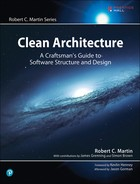

# Clean Architecture 中文

  

## 目录

- [第一部分 概述](./第一部分-概述/README.md)
  * [设计与架构究竟是什么](./第一部分-概述/1-设计与架构究竟是什么.md)
  * [两个价值维度](./第一部分-概述/2-两个价值维度.md)
 
- [第二部分 从基础构件开始：编程范式](./第二部分%20从基础构件开始：编程范式/README.md)
  * [编程范式总览](./第二部分%20从基础构件开始：编程范式/3-编程范式总览.md)
  * [结构化编程](./第二部分%20从基础构件开始：编程范式/4-结构化编程.md)
  * [面向对象编程](./第二部分%20从基础构件开始：编程范式/5-面向对象编程.md)
  * [函数式编程](./第二部分%20从基础构件开始：编程范式/6-函数式编程.md)
- [第三部分 设计原则](./第三部分%20设计原则/README.md)
  * [SRP：单一职责原则](./第三部分%20设计原则/7-SRP：单一职责原则.md)
  * [OCP：开闭原则](./第三部分%20设计原则/8-OCP：开闭原则.md)
  * [LSP：里氏替换原则](./第三部分%20设计原则/9-LSP：里氏替换原则.md)
  * [ISP：接口隔离原则](./第三部分%20设计原则/10-ISP：接口隔离原则.md)
  * [DIP：依赖反转原则](./第三部分%20设计原则/11-DIP：依赖反转原则.md)
- [第四部分 组件构建原则](./第四部分%20组件构建原则/README.md)
  * [组件](./第四部分%20组件构建原则/12-组件.md)
  * [组件聚合](./第四部分%20组件构建原则/13-组件聚合.md)
  * [组件耦合](./第四部分%20组件构建原则/14-组件耦合.md)
- [第五部分 软件架构](./第五部分%20软件架构/README.md)
  * [什么是软件架构](./第五部分%20软件架构/15-什么是软件架构.md)
  * [独立性](./第五部分%20软件架构/16-独立性.md)
  * [划分边界](./第五部分%20软件架构/17-划分边界.md)
  * [边界剖析](./第五部分%20软件架构/18-边界剖析.md)
  * [策略与层次](./第五部分%20软件架构/19-策略与层次.md)
  * [业务逻辑](./第五部分%20软件架构/20-业务逻辑.md)
  * [尖叫的软件架构](./第五部分%20软件架构/21-尖叫的软件架构.md)
  * [整洁架构](./第五部分%20软件架构/22-整洁架构.md)
  * [展示器和谦卑对象](./第五部分%20软件架构/23-展示器和谦卑对象.md)
  * [不完全边界](./第五部分%20软件架构/24-不完全边界.md)
  * [层次与边界](./第五部分%20软件架构/25-层次与边界.md)
  * [Main组件](./第五部分%20软件架构/26-Main组件.md)
  * [服务：宏观和微观](./第五部分%20软件架构/27-服务：宏观和微观.md)
  * [测试边界](./第五部分%20软件架构/28-测试边界.md)
  * [整洁的嵌入式架构](./第五部分%20软件架构/29-整洁的嵌入式架构.md)
- [第六部分 实现细节](./第六部分%20实现细节/README.md)
  * [数据库只是实现细节](./第六部分%20实现细节/30-数据库只是实现细节.md)
  * [Web是实现细节](./第六部分%20实现细节/31-Web是实现细节.md)
  * [应用程序框架是实现细节](./第六部分%20实现细节/32-应用程序框架是实现细节.md)
  * [案例分析：视频销售网站](./第六部分%20实现细节/33-案例分析：视频销售网站.md)
  * [拾遗](./第六部分%20实现细节/34-拾遗.md)

* [afterword](./afterword.md)