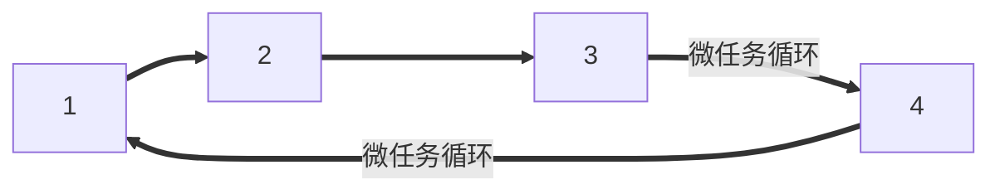

[TOC]

## javascript进阶

### 异步编程

#### 理解异步

##### 同步函数：

当一个函数是同步执行时，那么当该函数被调用时不会立即返回，直到该函数所要做的事情全都做完了才返回。**同步阻塞**

处理机制：当一个线程调用一个同步函数时，如果该函数没有立即完成规定的操作，则该操作会导致该调用线程**挂起**（将CPU的使用权交给系统，让系统分配给其他线程使用），直到该同步函数规定的操作完成才返回，最终该调用线程才能被重新调度。

##### 异步函数：

如果一个异步函数被调用时，该函数会立即返回，尽管该函数规定的操作任务还没有完成。**异步非阻塞**

处理机制：当一个线程调用一个同步函数时，该函数会立即返回*尽管其规定的任务还没有完成*，这样子线程就会执行异步函数的下一条语句，而不会被**挂起阻塞**。*该异步函数所规定的工作是由另外一个线程完成的*。

##### 进程与线程

 **进程是 CPU资源分配的最小单位；线程是 CPU调度的最小单位**。
一个进程由一个或多个线程组成，线程是一个进程中代码的不同执行路线

> 进程：一个程序的运行实例。cpu分配资源的最小单位。
>
> 通过**时间片调度算法**来实现多进程进行，或者说**并行执行**（如听音乐的同时写文档）
>
> 线程：cpu能够运算调度的最小单元。在进程中并行执行不同部分的任务。
>
> 线程实际上是为了优化时间片调度机制中，时间片到期后进程之间切换的速度，所开拓出来的

chrome浏览器中的主要线程：

- 浏览器（Browser）：控制 “Chrome” 应用程序，包括地址栏、书签、后退和前进按钮等。还需要处理 Web 浏览器的权限管理，例如网络请求和文件访问。
- 渲染器（Renderer）：控制选项卡内，网站里显示的所有内容。
- 插件（Plugin）：控制网站使用的插件，例如：Flash。
- GPU：独立于其他进程，专用于处理 GPU 任务，它被分成不同的进程，因为 GPU 会处理来自多个进程的请求，并将它们绘制在相同的 Surface 中。


浏览器的进程模式

为了节省内存，Chrome提供了四种进程模式(Process Models)，不同的进程模式会对 tab 进程做不同的处理。

* Process-per-site-instance (default) - 同一个 site-instance 使用一个进程

* Process-per-site - 同一个 site 使用一个进程

* Process-per-tab - 每个 tab 使用一个进程

* Single process - 所有 tab 共用一个进程

##### 被调用方通知调用方的方法：


* 回调

  

* 事件

  

* 消息

  

##### 面试题

**为什么不建议采用定时器实现动画？requestAnimationFrame有哪些优势？**

> 定时器的回调不能保证是按照指定时间之后调用 只是会按照指定时间被插入任务队列 要等待主线程空闲才会被调用
>
>  所以不能保证是在渲染的每帧开始的时候执行动画 也就可能出现跳帧
>
> 另外，通过定时器修改元素位置属性实现的动画，会导致频繁的重排和重绘，从而影响到性能。

>  **requestAnimationFrame最大的优势是由浏览器来决定回调函数的执行时机，即紧跟浏览器的刷新步调。**
>
>  如果屏幕刷新频率是60Hz，那么回调函数每16.7ms被执行一次，如果屏幕刷新频率是75Hz，那么这个时间间隔就变成了1000/75=13.3ms。它能保证回调函数在屏幕每一次的刷新间隔中只被执行一次，这样就不会引起丢帧现象，自然不会导致动画的卡顿。
>
>  CPU节能：使用setTimeout实现的动画，当页面被隐藏（隐藏的`<iframe>`）或最小化（后台标签页）时，setTimeout仍然在后台执行动画任务，由于此时页面处于不可见或不可用状态，刷新动画是没有意义的，而且还浪费 CPU 资源和电池寿命。而requestAnimationFrame则完全不同，当页面处于未激活的状态下，该页面的屏幕绘制任务也会被浏览器暂停，因此跟着浏览器步伐走的requestAnimationFrame也会停止渲染，当页面被激活时，动画就从上次停留的地方继续执行，有效节省了 CPU 开销，提升性能和电池寿命。

**浏览器采用多进程架构有什么优势和劣势？**

> 优势：单个tab页具有更好的健壮性，安全性、沙盒性。在面临一个进程崩盘的时候，并不会影响其他网页应用线程。更快的响应速度

> 劣势：占用内存更大，更加耗费资源。

----

#### EventLoop事件循环

##### 为什么JavaScript要设计成单线程？

js的设计之初就是为了执行脚本，不管是执行脚本，还是渲染dom、操作dom、发送请求，其目标都是呈现页面，单线程恰恰保证了呈现页面的过程中不会发生冲突，所以根本使用不到多线程；发展到如今的js所负担的任务变得沉重，但因为webwoker和EventLoop机制，单线程丝毫不影响其运行效率，

##### 什么是EventLoop？

1. 在执行主线程的任务时，如果有*异步任务*，会进入到Event Table并注册回调函数，当指定的事情完成后，会将这个回调函数放到 **callback queue** 中
2. 在主线程执行完毕之后，会去读取 **callback queue**中的回调函数，进入主线程执行
3. 不断的重复这个过程，也就是常说的Event Loop（事件循环）了


重点在于*异步任务*，他们分为宏任务和微任务，两者区别于在指定的事情完成后，将回调函数放入 **callback queue** 的过程。

我们也不难看出，**dom渲染**会在微任务队列清空后进行。

##### 宏任务与微任务

> 我们通常把宿主发起的任务称为**宏观任务**(`script`其实也算宏任务，但因为他们只执行一遍，所以接下来宏任务里不讨论`script`的存在)，把JavaScript引擎发起的任务称为**微观任务**

常见宏任务：`setInterval()`，`serTimeout()`，`setImmediate()`(实际上`setImmediate()`优先级小于前者)

常见微任务：`Promise().then(function(){})`（promise-then里的回调函数，`new MUtationObserver()` 

`process.nextTick(function(){})`(同上)(另外，实际上后者优先级高于前者)

两者在事件轮询中的区别在于，轮询到微任务时，会将微任务队列全部推出再去轮询下一步；轮询到宏任务时，只推出了队列中最早的异步任务

**为什么要设计微任务？**

> 解决了宏任务执行时机不可控的问题。微任务宏任务将异步分成了缓急两个任务队列

##### 简述事件循环闭环流程

> 我们可以想象成**宏任务**循环里套着**微任务**循环，*在检查宏任务之前*，*执行完宏任务之后*，分别插入**微任务循环**。

宏任务过程：

1. 选择宏任务队列中最早的任务（任务A）
2. 将“当前正在运行的任务”设置为“任务A”
3. 运行“任务A”同步代码（也就是运行回调函数）
4. 将“当前正在运行的任务”设置为`null`，删除“任务A”，本次Loop结束
5. 选择下一个最早的任务，也就是跳转到1，直到宏任务队列清空



微任务过程：

a. 选择微任务队列中最早的任务（任务x）

b. 将“当前正在运行的任务”设置为“任务x”

c. 运行“任务x”同步代码（也就是运行回调函数）

d. 将“当前正在运行的任务”设置为`null`，删除“任务x”

e. 选择下一个最早的任务，也就是跳转到1，直到微任务队列清空


##### 浏览器和node的区别
宏任务
| \                                   | 浏览器 | Node |
| ----------------------------------- | ------ | ---- |
| I/O                                 | ✅      | ✅    |
| setTimeout                          | ✅      | ✅    |
| setInterval                         | ✅      | ✅    |
| setImmediate                        | ❌      | ✅    |
| requestAnimationFrame               | ✅      | ✅    |
| 页面交互：DOM、鼠标、键盘、滚动事件 | ✅      | ✅    |
| script                              | ✅      |      |

微任务
| /                          | 浏览器 | Node |
| -------------------------- | ------ | ---- |
| process.nextTick           | ❌      | ✅    |
| MutationObserver           | ✅      | ❌    |
| Promise.then catch finally | ✅      | ✅    |

##### vue的异步更新队列

会优先选择微任务`Promise.then`、`MutationObserver` 和 `setImmediate`，如果执行环境不支持，则会采用宏任务`setTimeout(fn, 0)` 代替。


#### 发布-订阅

> 浏览器进程里有许多线程，但主线程是`JavaScript引擎`，其他线程都是为了服务主线程而存在。而这些线程之间通讯方式就是通过**发布-订阅**来完成的，也称**消息队列**

##### 异步编程的解决方案

最早的社区版本就是用的**发布-订阅**，后来改进到`deferred`对象，也就是早期的`Preomise`对象

后来发布了官方规范`Promise` =>  `Geneatator` =>  `async/await`

他们的终极目的都是一样的——以同步的方式书写异步代码

##### 发布-订阅模式与观察者模式的区别

发布订阅模式：可以完全解耦代码，发布者与订阅者之间没有必然联系，他们并不知道彼此的存在，只通过事件中心的消息进行通讯

观察者模式：**被观察者**`Subject`只需要去维护一套**观察者集合**`Observer`，在状态发生变更时，去自动通知观察者集合里的**观察者**`Watcher`，这个模式是松耦合的，他们是清楚彼此的存在的。


#### 深入理解promise

异步操作的回调嵌套也就是回调地狱

当使用第三方异步函数，并给他传入异步之后的**回调函数**时，会产生可靠性丢失，其实是转移了控制权

期待第三方函数可以做到：

* 不会太早调用我的回调函数
* 不会太迟调用我的回调函数
* 会给我的回调提供必要的参数
* 在我的回调失败的时候会提醒我

但事实上我们控制不了以上的几点

所以`Promise`诞生了，解决了**可靠性丢失**，但依然存在**回调地狱**

`Promise`会在异步事件完成之后给我发送**成功与否**的通知，而不是我给它传入回调，控制权始终在自己手中。也就是发布订阅模式

**缺点**

* 无法取消`Promise`，一旦新建他就会立即执行，无法中途取消
* 如果不设置回调函数，`Promise`内部抛出的错误，就不会反映到外部
* 当处于`pending`状态时，无法得知目前进展到哪一个阶段（刚刚开始还是即将完成）


#### Generator函数及其异步使用

非抢夺式任务

进程在执行完成之后主动让出执行权

抢夺式任务

也就是通过时间片来决定执行权，也通过优先权

协程 

在用户明确放弃执行权的时候，才主动让出。


```javascript
function* gen(x){
  var y = yield x + 2;
  return y
}
var g = gen(1)
g.next() // {value:3, done:false}
g.next() // {value:undefined, done:true}
```


#### Thunk函数的Generator自执行器

thunk函数将参数和回调分开，封装固定部分参数，再执行时传入回调参数。

```javascript
test(a,b,cb)
thunkTest = thunk(test)(a,b)
thunkTest(cb1)
thunkTest(cb2)...
// 实现Thunk
function thunk(fn){
	return function(){
    let args = [...arguments]
    return function(cb){
			fn.apply(this,[...args,cb])
    }
  }
}
```

Generator自调用函数

就是让生成器能够自动执行，将包含`next()`的回调传入下一个thunk化的异步函数中

```javascript
add(a,b,cb)
cb = console.log
addThunk = Thunk(add)
// addThunk函数接受了固定参数之后还可以接收回调函数
// 回调函数，是上一个yield的结果，传入的
function* gen(){
  yield addThunk(1,2)
  yield addThunk(3,4)
  ...
}
function run(fn){
  let g = fn()
  function next(err,data){
		let ret = g.next(data)
    if(ret.done) return
    ret.value(next) //这里是addThunk绑定了ab之后返回的函数
    								// 需要继续绑定回调，然后next被传进去了
  }
  next()
}  
run(gen)  
```


#### co模块源码分析


#### 深入理解async await

异步终极解决方案，Generator的语法糖

> 语法糖：用更简练的言语表达复杂的含义，在得到广泛接受的情况之下，可以提升交流的效率

##### `Generator`与`async`的差异

`async`自带执行器

`async`清晰的语义

`async`的返回值是`Promise`对象，而`Genarator`的返回值是`Iterator`对象

`async`的`await`命令后面，可以是`Promise`对象和原始类型的值（数值、字符串和布尔值，但这时会自动转换成立即`resolved`的`Promise`对象）

##### await线程睡眠

在执行到`await`后边的异步任务时，会阻塞其他`await`操作，直到异步任务完成，才能进行下一个`await`

##### async的错误处理

1. 通过`try{}catch(e){}`来捕捉错误

2. 在`await`语句后边跟上`.catch()`

##### async的并发处理

```javascript
let foo = await getFoo()
let bar = await getBar()
// 这样子书写，getBar会被getFoo阻塞，
// 但实际上在两个没有关联的操作间这种阻塞是没有必要的
// 可以通过Promise.all()
let [foo,bar] = await Promise.all([getFoo(),getBar()])
// 或者直接进行这个异步操作，在拿到结果后，再await
let fooPromise = getFoo()
let barPromise = getBar()
let foo = await fooPromise
let bar = await barPromise
```

##### 深入理解`async`

```javascript
async function fn(args){
  //...
}
// 等同于
function fn(args){
  return packing(function* (){
    
  })
} 
// packing
```


#### 手写promise

高频面试题

1. Promise解决了什么问题？

   异步任务执行信任问题，地狱嵌套

2. Promise在事件循环中的执行过程是怎样的？

   加入到微任务队列

3. Promise有什么缺陷，可以如何解决？

   无法取消`Promise`，一旦新建他就会立即执行，无法中途取消

   如果不设置回调函数，`Promise`内部抛出的错误，就不会反映到外部

   当处于`pending`状态时，无法得知目前进展到哪一个阶段（刚刚开始还是即将完成）

   

4. 手写符合Promise/A+规范的Promise

Promise的规范：

1. 三种状态，只有异步操作的结果可以决定当前是哪一种状态
2. 状态的变化不可逆，且只有两种情况。
3. 一个promise必须提供一个then方法，用来获取当前异步操作的value或error
4. then方法接受两个参数onFulfilled，onRejected
5. then方法返回的是一个新的Promise实例

```javascript
var cache = {}
var container = function(){
  flags = typeof flags == "string" ? (cache[flags] || createFlags(flags)): exted({},flags)
  var stack = [] //回调列表
  var fire = function(data){
    var len = stack.length
    var i = 0
    for(;i<len;i++){
      stack[i].apply(data[0],data[1])
    }
  }
  var self = {
    add: function(){
      (function(args){
        Array.from(args).forEach((arg)=>{
          if(toString.call(arg) === "[object Function]"){
            // 检测重复的回调
            if(!self.has(arg)){
                          stack.push(arg)


            }
          }else if(arg && arg.length && typeof arg !=="string"){
              add(arg)
            }
        })
      })(arguments)
    },
    // 这里一定要传值，区分resolve和reject
    startupWith: function(ctx,args){
      args = args || []
      args = [ctx,args]
      fire(args)
    }
    startup: function(this){
      self.startupWith(this,arguments)
    }
    has: function(fn){
      return stack.indexOf(fn) > -1
    }
  }
  return self
}
function createFlags(flags){
  var res = {}
  (flags.match(/\S+/g) || []).forEach(function(flag){
    res[flag] = true
  })
}
```

##### 再次手写

```javascript
```


#### Web Worker多线程机制

单线程无法完全发挥出多核CPU的性能

主线程碰到费时的操作时，分配给Web Worker线程去执行，等到执行完再将结果返回给主线程

##### 历史

2009-firefox

2012-IE浏览器，以及其他浏览器

2015发布的版本沿用至今

##### DedicatedWorker和SharedWorker两种规范 

SharedWorker：所有页面都可以访问SharedWorker；兼用性特别差

DedicatedWorker：单个页面只能访问当前页面下的Worker

##### 用户感知性能模型RAIL

> 同步JS执行时间不能过长，量化来说，播放动画时建议小于16ms，用户操作相应建议小于100ms，页面打开到呈现内容建议小于1000ms

一个渲染帧也就是16ms

渲染帧流程：


如果加载js时间超过16ms，那就会失去一个渲染帧，页面就会出现卡顿。

优化：


##### 同步任务的异步化执行


将可能耗时过长的Jank Job，移到Woker 线程，从而实现主线程和Worker线程的并行执行，直到Jank Job返回结果给到主线程

##### Worker对于性能提升

其实并没有性能提升，性能只于CPU相关，单核CPU就慢，多核CPU就快。其实在分配Woker线程的时候也需要时间、空间，包括线程之间的通讯，都需要额外的性能；当然这在多核CPU上是不算什么，它们会并行执行；而在单核CPU上它们是通过时间片机制轮转的。

Woker所提升的是用户体验，是UI渲染流畅度。

##### Worker的通讯

通讯开销：在主线程post => woker的onMessage接收，这中间是有时间差的

```javascript
//main.js
const worker = new Worker('./worker.js')
worker.postMessage('hello')
worker.onmessage = (event) => {
  console.log(event.data) //world
}
//worker.js
self.onmessage = (event) => {
  console.log(event.data) //hello
  postMessage('world')
}
```

##### Worker的运行环境


相同点


差异点


#### Rxjs复杂异步场景

##### Reactive Extension(推)

对很多语言都有支持，是实践响应式编程的一套工具。

`Rxjs`是**推送数据**的，不管是异步还是同步数据。

* 数据流抽象了很多现实问题
* 擅长处理异步操作
* 把复杂问题分解成简单问题的组合

`Observable`和`Observer`

**可被观察者**和**观察者**，连接两者的桥梁是`Observable`对象的函数`subscribe`；`Rxjs`中的数据流就是`Observable`对象，它实现了以下两种设计模式

- 观察者模式

  

- 迭代器模式

  能够遍历一个数据集合的对象，因为数据集合的实现方式很多，可以是一个数组，也可以是一个树形结构，也可以是一个单向链表……迭代器的作用及时提供一个通用的接口，让使用者完全不用关心这个数据集合的具体实现方式

  通常包含这样几个函数

  - `getCurrent`，获取当前被游标所指向的元素
  - `next`，将游标移动到下一个元素，调用这个函数之后，`getCurrent`获得的元素就会不同。
  - `isDone`判断是否已经遍历完所有的元素

##### 跨越时间的`Observable`

```javascript
const source = new Observable(subscriber =>{
  let n = 1
  const handle = setInterval(()=>{
    subscriber.next(n++)
    if(n>3){
      clearInterval(handle)
      subscriber.conplete()// => 进入到了完成终结状态
      subscriber.error(e) // => 进入到了错误终结状态
    } 
  },1000)
})

source.subscriber({
  next(x){
    console.log(x)
  },
  complete(){ // => 进入到了完成终结状态
    console.log('no data')
  },
  error(e){ // => 进入到了错误终结状态
    console.log(e)
  }
})
```

##### 退订`Observable`

```javascript
const source = new Observable(subscriber =>{
  let n = 1
  // 无限推送
  const handle = setInterval(()=>{
    subscriber.next(n++)
    return { // 这个对象赋值给了sub
      unsubscribe:()=>{
        clearInterval(handle)
      }
    }
  },1000)
})

const sub = source.subscriber({
  next(x){
    console.log(x)
  },
// 	 三秒之后退订
  setTimeout(() => {
  	sub.unsubscribe()
},3000)
})
```

##### 创建数据流

同步数据流，或者说同步`Observable`对象，需要关心的就是：产生哪些数据；数据之间的先后顺序如何。

对于同步数据流，数据之间的时间间隔不存在，所以不需要考虑时间方面的问题

同步操作符，`of`操作符

异步数据流，在`Rxjs`中`interval`和`timer`两个操作符就相当于`Javascript`中的`setInterval`和`setTimeout`

`from`操作符把任何对象转换成`Observable`对象

`Promise`和`Rxjs`的对比

- `Rxjs`多次执行
- `Rxjs`取消订阅


#### 拓展

异步考试题

```javascript
// Promise.resolve()
//   .then('b')
//   .then(Promise.resolve('c'))
//   .then(console.log)
//
// Promise.resolve({
//   then: function () {
//     console.log('a');
//   }
// }).then(() => { console.log('d'); })
//-----//
// Promise.resolve({
//   then: function (fullfill) {
//     fullfill('a');
//     console.log('b')
//     throw new Error('c')
//     console.log('d');
//   }
// }).then(
//   (d) => { console.log(d); },
//   (err) => { console.log(err.message); },
// );
//-----

// Promise.resolve(3).then(() => {
//   console.log('a');
//   throw new Error('b');
// }).then(() => {
//   console.log('c');
// }, (err) => {
//   console.log(err.message);
//   return 'd';
// }).then((d) => console.log('d'), (e) => { console.log('e') })
//------
// new Promise(function (resolve, reject) {
//   resolve('a');
//   throw new Error('b');
// })
//   .then(console.log)
//   .catch(console.log);
//------
// function* gen() {
//   var a = yield 'a';
//   var b = yield a + 'b';
//   return b;
// }
// var g = gen();
//
// console.log(g.next());
// console.log(g.next('c'));
// console.log(g.next());
//-----
// function* gen1() {
//   yield 'a';
//   yield 'b';
// }

// function* gen2() {
//   yield* gen1();
//   yield 'c';
//   yield 'd';
// }

// function* gen3() {
//   gen1();
//   yield 'c';
//   yield 'd';
// }

// const g2 = gen2();
// const g3 = gen3();
// for (let v of g2) {
//   console.log(v);
// }
// for (let v of g3) {
//   console.log(v);
// }
//------
function geneP(d1, d2) {
  return new Promise(function (resolve, reject) {
    if (+new Date() > 0) {
      resolve(d1);
    } else {
      reject(d2);
    }
  });
}
function* gen() {
  yield geneP('yes', 'no');
  yield geneP('y', 'n');
}

function run(fn) {
  var g = fn();
  function next(data) {
    console.log(data);
    var result = g.next();
    console.log(result.value);
    if (result.done) return;
    result.value.then(next);
  }
  next();
}

run(gen);


//-----
// async function async1() {
//   console.log('1');
//   console.log(await async2()); // 0
//   console.log('2');
// }
// async function async2() {
//   console.log('3');
//   return '0';
// }
// setTimeout(function () { // hong
//   console.log('4');
//   new Promise(function (resolve) {
//     console.log('5'); resolve();
//   }).then(function () { console.log('6') })
// })
// async1();
// new Promise(function (resolve) {
//   console.log('7');
//   resolve();
// }).then(function () {
//   console.log('8'); 
//  return 10
// }).then(n => console.log(n));
// console.log('9');
// // 1 3 7 9 0 2 8
```


-----

### 设计模式


